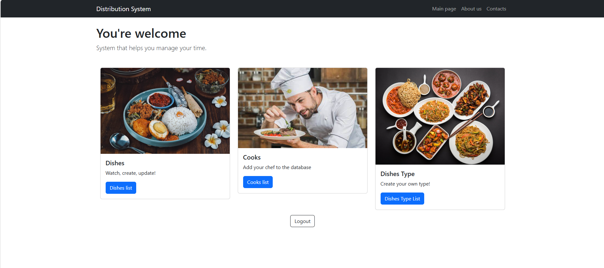

# Django Site

A web application built with [Django](https://www.djangoproject.com/), a high-level Python Web framework that encourages rapid development and clean, pragmatic design.

## 🚀 Features

- User authentication (login, logout, registration)
- Admin dashboard
- Dynamic templates with Django templating engine
- Modular apps structure
- Responsive UI using Bootstrap (or your preferred CSS framework)
- Custom error pages (404, 500, etc.)
- SQLite/PostgreSQL support

## shell
git clone https://github.com/FalseCoreCentury/kitchen-distributionhttps://github.com/FalseCoreCentury/kitchen-distribution
cd library-mate
python3 -m venv venv
source venv\bin\activate
pip install -r requirements.txt
python manage.py runserver

## 📦 Requirements

- Python 3.8+
- Django 4.x
- pip (Python package installer)
- Virtualenv (recommended)

## 🛠️ Installation

1. **Clone the repository:**

## Demo

